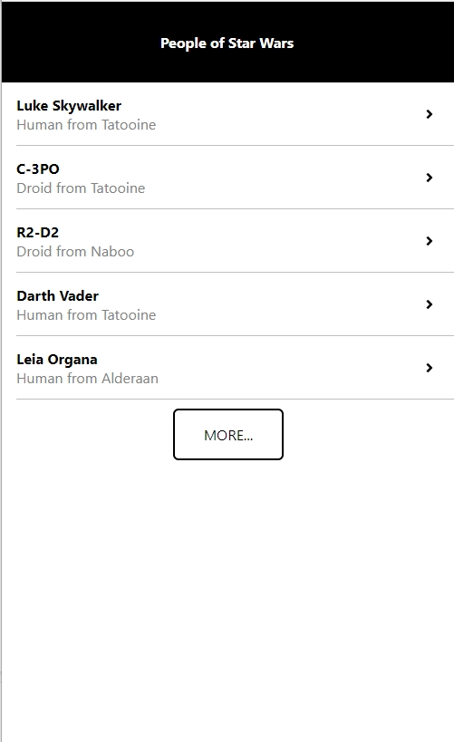
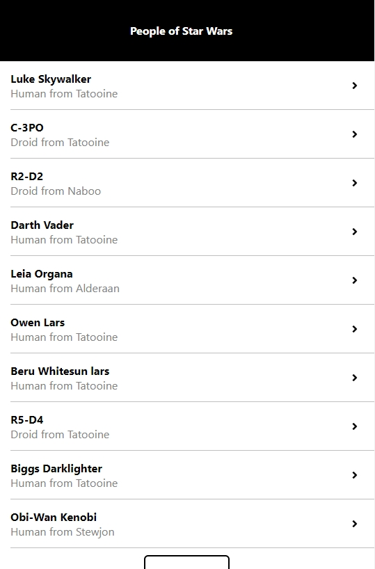
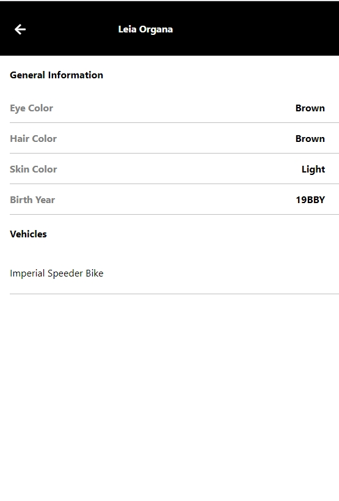

# README

## Instalación
Este proyecto fue creado con [Create React App](https://github.com/facebook/create-react-app).

Para poder ejecutar el proyecto necesitamos instalar las dependencias primero con el comando:

### `npm install`

Seguidamente para iniciar la aplicación ejecutamos el siguiente comando `

### `npm start`

Este modo de ejecución es en modo de desarrollo, el cual nos abrira la dirección: [http://localhost:3000](http://localhost:3000) en nuestro navegador por defecto.

## Descripción del Proyecto
El siguiente proyecto se encarga de consumir un servicio hecho en GraphQL, el cual brinda los datos de la pelicula de
Star Wars, como los personajes, vechiculos que conducen, ragos de los personajes, los planetas, etc.

Brindando así las siguientes interfaces:

En el cual podemos solicitar que nos brinden más personajes en la lista, dando click en el botón MORE 

Dando click en uno de los personajes nos enviara a una vista en el cual veremos los datos del personaje.

## Tecnologías Usadas

- ReactJs
- Apollo Client

